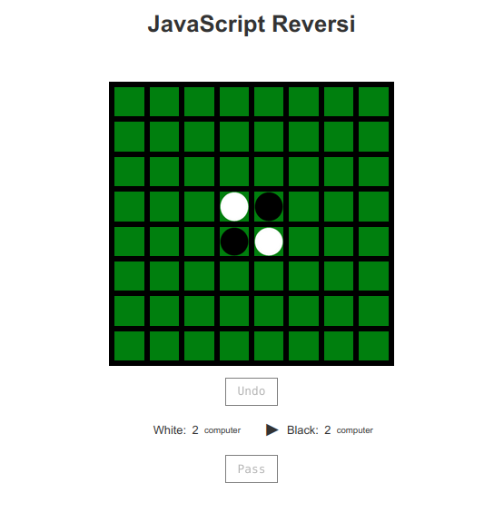

# JavaScript Reversi: Modern Uyarlama

Bu proje, David Bau tarafından 2009 yılında geliştirilen klasik Reversi (Othello) oyununun modern JavaScript ve ES6+ standartlarına uyarlanmış bir versiyonudur. Oyun, yapay zeka (AI) destekli tek oyunculu mod ve interaktif bir arayüz sunar.



## Özellikler
- **Modern JavaScript:** ES6+ söz dizimi (sınıflar, arrow fonksiyonlar, `const`/`let`).
- **AI Algoritması:** Minimax optimizasyonu ve derinlik tabanlı arama.
- **Responsive Tasarım:** Mobil cihazlara uyumlu arayüz.
- **Oyun İçi Kontroller:** Geri alma/tekrarla, renk seçimi, zorluk ayarları.
- **URL Parametreleri:** `easy`, `small`, `white` gibi özelleştirmeler.

---

## Kronoloji

### **Ağustos 2009** - İlk Yayın
- David Bau, orijinal JavaScript Reversi kodunu [kişisel blogunda](http://davidbau.com/archives/2009/08/23/javascript_reversi.html) paylaştı.
- Temel özellikler: 8x8 tahta, AI desteği, jQuery tabanlı etkileşim.

### **Ekim 2012** - İlk Güncelleme
- Tahta skorlama matrisi optimize edildi.
- Hafıza yönetimi iyileştirildi.

### **Mart 2020** - Modernizasyon Çalışmaları
- jQuery bağımlılığı kaldırıldı (vanilla JavaScript'e geçiş).
- `var` → `let`/`const` dönüşümü yapıldı.
- Modül yapısına ön hazırlık.

### **Eylül 2023** - Güncel Sürüm (v2.0)
- **ES6+ Yenilikleri:**
  - Sınıf tabanlı yapı (`Board`, `Node`, `SearchStack`).
  - Arrow fonksiyonlar ve template literals.
  - `fetch` API ile dinamik asset yükleme.
- **Performans İyileştirmeleri:**
  - AI derinlik arama algoritması optimize edildi.
  - Animasyonlar için `requestAnimationFrame` entegrasyonu.
- **UI Güncellemeleri:**
  - CSS Grid ile responsive tahta.
  - SVG ikonlar ve tema desteği.
- **Yeni Parametreler:**
  - `?easy`: Basitleştirilmiş AI.
  - `?small`: Kompakt tahta görünümü.
  - `?quiet`: Metinlerin gizlenmesi.

---

## Kurulum
1. Repoyu klonlayın:
   ```bash
   git clone https://github.com/metatronslove/reversi.git
   ```
2. Gerekli asset'leri `assets/` klasörüne yerleştirin:
   - `black.gif`, `white.gif`, `green.gif`
3. Tarayıcıda `index.html` dosyasını açın.

## Oynatma Talimatları
- **Taş Yerleştirme:** Boş hücrelere tıklayın.
- **Renk Seçimi:** "White" veya "Black" etiketlerine tıklayarak AI'nın rengini değiştirin.
- **Kontroller:**
  - `Undo`: Son hamleyi geri al.
  - `Pass`: Sırayı rakibe devret.
  - `Redo`: Geri alınan hamleyi tekrarla.

## Teknik Detaylar
- **AI Algoritması:** Derinlik tabanlı minimax + alfa-beta budama.
- **Skorlama:** Pozisyonel ağırlık matrisi ([detaylar](#score-vector)).
- **Zaman Yönetimi:** Dinamik zaman aşımı (`setTimeout` optimizasyonu`).

---

## Katkıda Bulunanlar
- **David Bau**: Orijinal kod ve algoritma.
- [metatronslove]: Modernizasyon ve dokümantasyon.

## Lisans
MIT Lisansı altında dağıtılmaktadır. Detaylar için [LICENSE](LICENSE) dosyasına bakın.

---

**Not:** Orijinal kod ve tarihçe için [David Bau'nun makalesini](http://davidbau.com/archives/2009/08/23/javascript_reversi.html) ziyaret edin.